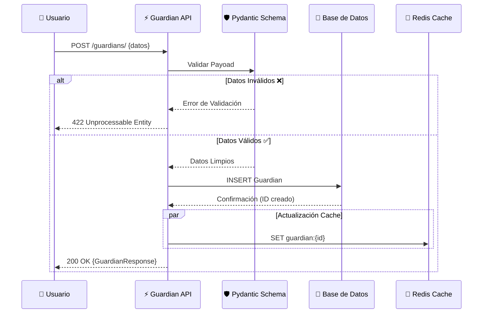

# 🏗️ Guardian API Architecture

> Documentación técnica del sistema Guardian API, diseñado con principios de **Platform Engineering** y **DevOps Moderno**.

---

## 🧩 Diagrama de Componentes (C4 Nivel 2: Contenedores)

Este diagrama muestra cómo interactúan los contenedores Docker orquestados por Docker Compose.

```mermaid
graph TD
    subgraph Client [Cliente]
        Browser[fa:fa-globe Navegador / Curl]
        Swagger[fa:fa-file-code Swagger UI]
    end

    subgraph DockerHost [🐳 Docker Host (Docker Compose)]
        direction TB

        subgraph AppContainer [Contenedor API]
            FastAPI[⚡ FastAPI App]
            Pydantic[🛡️ Validación Pydantic]
            SQLAlchemy[🗃️ ORM SQLAlchemy]
        end

        subgraph DataLayer [Capa de Datos]
            Redis[(🔴 Redis Cache)]
            Postgres[(🐘 PostgreSQL)]
        end

        AppContainer -- "Puerto 8080" --- Browser
        FastAPI -- "Lectura/Escritura Rápida" --> Redis
        FastAPI -- "Persistencia Relacional" --> Postgres
    end

    Browser --> |HTTP/JSON vía REST| FastAPI
    Swagger --> |Docs Interactivas| FastAPI
```

---

## 🔄 Flujo de Datos (Sequence Diagram)

Ejemplo de creación de un Guardián y cómo fluyen los datos a través de las capas.



---

## 🛠️ Stack Tecnológico

Este proyecto implementa prácticas modernas de ingeniería de software:

| Componente          | Tecnología              | Propósito                                       |
| ------------------- | ----------------------- | ----------------------------------------------- |
| **Lenguaje**        | Python 3.12             | Tipado estático fuerte, rendimiento moderno.    |
| **Framework**       | FastAPI                 | API REST asíncrona de alto rendimiento.         |
| **Validación**      | Pydantic v2             | Validación de datos robusta y serialización.    |
| **Base de Datos**   | SQLAlchemy 2.0          | ORM moderno para interacción SQL segura.        |
| **Cache**           | Redis 7                 | Almacenamiento clave-valor para alta velocidad. |
| **Infraestructura** | Docker & Compose        | Contenerización y orquestación local.           |
| **Testing**         | Pytest & Testcontainers | Pruebas unitarias y de integración aisladas.    |

---

## 🚀 Puntos Clave para LinkedIn

Si compartes esto en LinkedIn, puedes destacar:

1.  **Arquitectura Limpia**: Separación de responsabilidades entre Modelos (ORM), Esquemas (Pydantic) y Servicios.
2.  **DevOps First**: Entorno reproducible con Docker y Docker Compose desde el día 1.
3.  **Resiliencia**: Manejo de errores robusto y validaciones estrictas para asegurar la integridad de datos.
4.  **Testing Moderno**: Uso de contenedores efímeros para pruebas de integración reales (no solo mocks).
